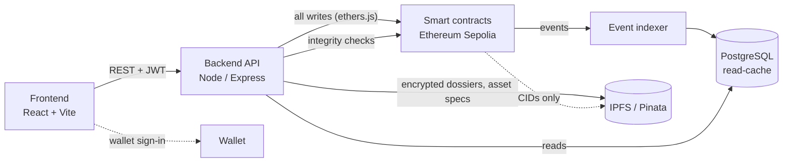

# BELTAL

**Blockchain-Enabled Trusted Access & Asset Ledger**
Smart India Hackathon 2026 | Problem Statement 26125 | Bharat Electronics Limited (BEL)

BELTAL is a blockchain-backed trust layer that sits underneath BEL's existing systems. Today, identity records, access rights and equipment ownership live in ordinary databases where an insider (or an attacker) can quietly edit them and leave no trace. BELTAL gives every identity change, access decision and asset transfer a permanent, independently verifiable record on-chain, so any record can be checked against the ledger instead of trusting a database.

## Features

- **Wallet sign-in.** No passwords. The user's wallet signs a one-time, server-issued nonce; the server verifies the signature and issues a JWT. The role always comes from the identity the server holds for that wallet, never from anything the client sends. The "portal" picked on the login screen is only a preference: users are always taken to the portal for their real role.
- **Self-registration and approval.** A wallet with no identity gets a limited session that can only submit a registration (full name, employee ID, SBU). The request stays pending, with no access, until an admin approves it and assigns a role and clearance level, or rejects it with a reason. The first admin is bootstrapped by listing wallet addresses in `ADMIN_WALLETS`; those wallets are auto-approved as Admin when they register.
- **Decentralized identity (DID).** Approving a registration ties a person's name and employee ID to their wallet. The chain stores only a DID and a salted hash; the full details are encrypted (AES-256-GCM) and pinned to IPFS, so no personal data is public.
- **Role-based access.** Admin, Manager, Auditor and User, plus a machine-only System Connector role for automated PACS/HR ingest. The API enforces roles on every route, and the contracts restrict who may write. Managers see and act only within their own SBU, auditors are read-only, and nobody can approve their own transfer request. Clearance levels (1 to 4) and Strategic Business Units (Radar, EW, MilComm, Cyber) further gate who may hold what.
- **Asset minting.** Each piece of equipment or credential is minted as a unique token linked to its custodian. Tokens are soulbound: standard ERC-721-style transfers are disabled, and custody can only change through the controlled flow below. The chain holds the asset tag, classification tier, SBU, current custodian, custody history and an IPFS CID; IPFS holds the full specification; PostgreSQL only caches it for fast queries.
- **Asset transfer.** A custodian, manager or admin requests a transfer; the backend checks the recipient's clearance and SBU (a cross-SBU pass covers the exception); a Manager or Admin approves it and the custody change executes on-chain. Requests can also be rejected.
- **Immutable audit trail.** Identity, role, asset and access events are appended to an on-chain `AuditLog`, indexed into PostgreSQL, and exposed as a paginated, filterable audit API and explorer UI.
- **Verification and tamper detection.** An auditor can re-derive the expected state (asset CID and custodian from the chain; identity hash from the decrypted IPFS dossier) and compare it to the database. A mismatch means the database was edited behind the application's back and returns `INTEGRITY_COMPROMISED`. The identity check covers hash, clearance, SBU and active or revoked status. Any transaction can also be checked directly against Sepolia. Auditors do this from the verification page (transaction check and "Anti-Tamper Lab"). For demos, the lab has a "Simulate insider tamper" button that forges a clearance or classification tier in the database only (never the chain), so the next check visibly catches it, and a "Restore from chain" button that puts it back. It is on by default outside production and controlled by `ENABLE_TAMPER_SIMULATION`.
- **PACS zone access and emergency lockdown.** A badge tap is sent by the System Connector; access is decided on-chain from identity, clearance, SBU and lockdown state, then logged. An admin can lock down a zone instantly, and a locked zone denies everyone. Admins create zones and set their clearance and SBU from the Facility Zones screen. A demo badge-tap simulator lets admins and managers try taps from the browser.
- **Quarantine and revocation.** An admin can revoke an identity with a mandatory reason. The DID is deactivated in the `IdentityRegistry` and the wallet's role is removed from `AccessControl`, both on-chain, and the person is rejected on their very next request instead of when their JWT expires. Revocation cannot target yourself or the last active admin, and an admin can reinstate an identity later (the registry has no undo, so this re-registers the same DID, hash, clearance and SBU).
- **Cross-SBU passes.** Admins and Managers grant time-boxed passes, from the Access Passes screen, that give a person from another SBU visibility into the issuing manager's unit and let them take custody of its assets. A pass grants visibility, not authority.
- **Bulk onboarding.** An admin uploads an HRMS CSV export. Every row is validated and the generated DIDs previewed first; only once the whole file is clean are the identities registered on-chain in batches of up to 250 per transaction, so a bad file is never half-imported.
- **Guardian recovery.** If someone loses the wallet their identity is anchored to, guardians assigned to them vouch for a replacement. Once enough have approved — and never on the word of the person who raised the request — an admin re-links the identity: the old wallet is revoked on-chain and the same DID and identity hash are re-anchored to the new one, so the audit trail shows one person changing keys rather than a new employee appearing. Admins manage guardians and run requests from the Account Recovery screen.
- **AI audit assistant.** Auditors and admins can ask plain-English questions about the audit trail. The assistant answers only from rows it fetched through the same role-gated audit service the REST API uses, and the interface shows those records beneath the answer so it can be checked rather than trusted. Disabled unless `ANTHROPIC_API_KEY` is set.

## How it works

1. A user signs in with their wallet and receives a JWT. New wallets register first and wait for admin approval.
2. The frontend calls the backend REST API. **Every write** (register identity, mint, transfer, lockdown) is submitted by the backend to the smart contracts on Ethereum Sepolia.
3. The contracts emit events. An indexer in the backend listens for them and writes them into PostgreSQL, so dashboards and the audit explorer load quickly without querying the chain each time.
4. Encrypted identity dossiers and asset specifications go to IPFS (via Pinata), both AES-256-GCM encrypted before they leave the server; only their CIDs are recorded on-chain. `GET /api/ipfs/:cid` fetches and decrypts a pinned document for admins and auditors.

**The chain is the source of truth.** PostgreSQL is a disposable read-cache, and the verification service exists precisely to catch it drifting from the chain.



### Smart contracts

| Contract | Purpose |
|---|---|
| `IdentityRegistry` | DIDs, identity hashes, clearance levels, revocation, single and batch registration |
| `AccessControl` | Role grants, PACS facility zones, temporary passes, emergency lockdown, on-chain access check |
| `AssetNFT` | Soulbound asset tokens, custody history, maintenance flag, clearance-gated custody changes |
| `AuditLog` | Append-only audit stream written to by the other three contracts |

## Tech stack

| Layer | Technology |
|---|---|
| Smart contracts | Solidity 0.8.20, Hardhat, Ethereum Sepolia testnet |
| Backend | Node.js, Express 5, ethers.js, Prisma, PostgreSQL, Zod, Pinata (IPFS) |
| Frontend | React 19, Vite, Tailwind CSS 4, React Router, ethers.js |
| Auth | Wallet sign-in (nonce + ECDSA signature), JWT |

## Repository layout

```
blockchain/   Solidity contracts, Hardhat config, deploy script, tests
backend/      Express API (routes, controllers, services), Prisma schema and migrations
frontend/     React app (role-based dashboards for Admin, Manager, Auditor, User)
docs/         Supporting documentation
```

## Quick start

**Prerequisites:** Node.js, PostgreSQL, a browser wallet (MetaMask) on Sepolia, and optionally a Pinata account for IPFS pinning and a funded Sepolia key for deployment.

### 1. Smart contracts

```bash
cd blockchain
npm install
cp .env.example .env      # set SEPOLIA_RPC_URL, DEPLOYER_PRIVATE_KEY, ETHERSCAN_API_KEY
npm run compile
npm test
npm run deploy:sepolia    # or: npm run deploy:local
```

The deploy script also writes `blockchain/deployments/<network>.json` and copies the contract addresses and ABIs into the backend and frontend.

### 2. Backend

```bash
cd backend
npm install
cp .env.sample .env       # see the variables below
npx prisma migrate deploy
npx prisma generate
npm run dev               # or: npm start
```

The API listens on `http://localhost:4000/api` (health check: `/api/health`). To make your wallet the first admin, list it in `ADMIN_WALLETS` (or run `node seed-admin.js 0xYourWalletAddress`).

Demo data (identities for every role, zones, assets, a pending transfer, a pass and a pending registration):

```bash
npm run seed:demo -- --dry-run                 # show the plan, write nothing
npm run seed:demo -- --offchain --admin 0xYourWallet   # database only, no testnet ETH needed
npm run seed:demo                              # full on-chain seed (needs a funded deployer and Pinata)
```

Key variables in `backend/.env.sample`:

| Variable | Purpose |
|---|---|
| `DATABASE_URL` | PostgreSQL connection string |
| `RPC_URL`, `CONTRACT_ADDRESS` | Sepolia RPC endpoint and the deployed contract address |
| `DEPLOYER_PRIVATE_KEY` | Service key the backend uses to submit transactions |
| `SYSTEM_CONNECTOR_PRIVATE_KEY` | Separate key for the PACS/HR machine identity |
| `JWT_SECRET`, `JWT_EXPIRES_IN` | JWT signing (`JWT_SECRET` is required in production) |
| `INDEXER_FROM_BLOCK` | Block the contracts were deployed at. The event indexer backfills from here on first run, then resumes from its saved checkpoint after any downtime |
| `ADMIN_WALLETS` | Comma-separated wallet addresses auto-approved as Admin when they register (first-admin bootstrap) |
| `DOSSIER_ENCRYPTION_KEY` | 32-byte hex key for encrypting identity dossiers |
| `PINATA_JWT` (or `PINATA_API_KEY` / `PINATA_API_SECRET`), `PINATA_GATEWAY` | IPFS pinning |
| `PINATA_GROUP_ID` | Optional. Pins everything into one dedicated Pinata group |
| `ANTHROPIC_API_KEY` | Optional. Enables the AI audit assistant; unset hides it |
| `RECOVERY_APPROVAL_THRESHOLD` | Guardian approvals needed before a recovery may execute (default 2) |
| `ENABLE_TAMPER_SIMULATION` | Optional. Turns the Anti-Tamper Lab demo tools on or off. Default: on outside production, off in production |
| `FRONTEND_URL`, `PORT`, `LOG_LEVEL`, `NODE_ENV` | Server settings |

### 3. Frontend

```bash
cd frontend
npm install
cp .env.sample .env       # VITE_API_URL, VITE_RPC_URL, VITE_CONTRACT_ADDRESS, VITE_IPFS_GATEWAY
npm run dev               # http://localhost:5173
```

Other scripts: `npm run build`, `npm run lint`, `npm run preview`.

Never commit `.env` files or real keys.

## Status

Every feature listed above is implemented in the backend and contracts, and the Admin, Manager, Auditor and User portals are built, including the shared asset-detail view, the on-chain verification page with its Anti-Tamper Lab, the PACS badge-tap simulator and the AI audit assistant panel.

A public API reference for integrators lives at `/docs`, covering every endpoint with its authentication, roles, request and response shapes and error codes.

The former "Coming Soon" placeholder pages have been removed: they were unlinked and either duplicated an existing screen or had no backing feature.

## Future work

Deliberately left out of this build. Each is a self-contained addition that does not change the contracts or the core flows.

- **Bulk import UI.** The CSV import (`POST /api/admin/identities/bulk-import`, with a `/validate` dry run) is complete on the backend. It needs an admin screen with a file upload, the row-by-row validation report and DID preview, and per-batch results.
- **Calibration fields.** Assets do not yet carry a calibration certificate, last and next calibration dates or a maintenance flag. That means schema fields plus a minting-form upload (encrypted and pinned like the specification), a valid / expiring / expired indicator on the custody views, and an API route for `AssetNFT.setMaintenanceStatus`, which the contract already supports.
- **QR ID card.** The user dashboard shows the DID as text. A military-style ID card with a QR code encoding the DID would make it scannable at a checkpoint.
- **Guardian inbox.** Guardians can approve recovery requests through the API, but only admins have a screen. Guardians of any role need a view of the requests awaiting their vote.
- **On-chain custody signature (issue #100).** `AssetNFT.transferCustody` stores its signature argument without verifying it. EIP-712 verification would make dual authorisation a contract rule instead of a backend one.
