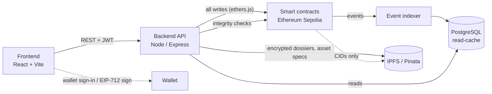

# BELTAL — Blockchain-Enabled Trusted Access & Digital Asset Ledger

> **Problem Statement ID**: SIH26125  
> **Organization**: Bharat Electronics Limited (BEL), Ministry of Defence, Govt. of India  
> **Category**: Software | **Theme**: Blockchain & Cybersecurity  

BELTAL is a defence-grade cryptographic access control and digital asset ledger system designed for Bharat Electronics Limited (BEL). Today, identity records, access rights and equipment ownership live in ordinary databases where an insider (or an attacker) can quietly edit them and leave no trace. BELTAL gives every identity change, access decision and asset transfer a permanent, independently verifiable record on-chain, so any record can be checked against the ledger instead of trusting a database.

## 📌 Executive Summary
**BELTAL** combines **Decentralized Identifiers (DIDs)**, **Soulbound ERC-721 Asset NFTs**, and **Smart Contract Security Clearance Enforcement** with a **Triad Data Architecture** (Zero on-chain PII, AES-256 encrypted IPFS storage, sub-5ms PostgreSQL cache) to prevent insider data tampering and provide immutable custody tracking across BEL's manufacturing units and Strategic Business Units (SBUs).

## 🏛️ System Architecture & Triad Model
* **On-Chain (Solidity ^0.8.20)**: `IdentityRegistry.sol`, `AccessControl.sol`, `AssetNFT.sol`, `AuditLog.sol` (Minimal cryptographic state, zero PII, DPDP Act 2023 compliant, on-chain EIP-712 custody verification).
* **Decentralized Storage (IPFS / Pinata)**: Client-side AES-256-GCM encrypted dossiers, calibration certificates, and asset specifications.
* **Query Engine (PostgreSQL + Prisma)**: Sub-5ms indexed cache synchronized in real-time via multi-contract event indexers.

---

## Features

- **Wallet sign-in.** No passwords. The user's wallet signs a one-time, server-issued nonce; the server verifies the signature and issues a JWT. The role always comes from the identity the server holds for that wallet, never from anything the client sends.
- **Self-registration and approval.** A wallet with no identity gets a limited session that can only submit a registration (full name, employee ID, SBU). The request stays pending until an admin approves it and assigns a role and clearance level.
- **Decentralized identity (DID).** Approving a registration ties a person's name and employee ID to their wallet. The chain stores only a DID and a salted hash; full details are encrypted (AES-256-GCM) and pinned to IPFS.
- **Role-based access.** Admin, Manager, Auditor and User, plus a machine-only System Connector role for automated PACS/HR ingest. Managers act only within their own SBU, auditors are read-only, and nobody can approve their own transfer request.
- **Asset minting.** Unique tokens linked to custodians. Soulbound: standard ERC-721 transfers are disabled, and custody can only change through authorized handover flows.
- **EIP-712 on-chain custody transfer (Issue #100).** Cryptographically verified custody transfers on-chain using EIP-712 typed-data recovery (`CustodyTransfer` struct with per-token replay-prevention nonces and timestamps/deadlines).
- **Immutable audit trail.** Identity, role, asset and access events are appended to an on-chain `AuditLog`, indexed into PostgreSQL, and exposed as a filterable audit explorer.
- **Verification and tamper detection.** An auditor can re-derive the expected state (asset CID and custodian from the chain; identity hash from the decrypted IPFS dossier) and compare it to the database, flagging any direct database tampering (`INTEGRITY_COMPROMISED`).
- **PACS zone access and emergency lockdown.** Real-time physical access decisions on-chain from identity, clearance, SBU and lockdown state. Admins can trigger instant emergency lockdowns.
- **Quarantine and revocation.** Immediate on-chain DID deactivation and role removal for compromised credentials.
- **Cross-SBU passes.** Time-boxed passes giving personnel cross-department asset visibility and custody authorization.
- **Bulk onboarding.** Batch registration of validated HRMS CSV exports up to 250 identities per on-chain transaction.
- **Guardian recovery.** Multi-guardian social recovery protocol for re-anchoring DIDs after lost private keys.
- **AI audit assistant.** Context-grounded audit query interface over indexed on-chain events.

## How it works

1. A user signs in with their wallet and receives a JWT. New wallets register first and wait for admin approval.
2. The frontend calls the backend REST API. **Every write** (register identity, mint, transfer, lockdown) is submitted by the backend to the smart contracts on Ethereum Sepolia.
3. The contracts emit events. An indexer in the backend listens for them and writes them into PostgreSQL, so dashboards and the audit explorer load quickly without querying the chain each time.
4. Encrypted identity dossiers and asset specifications go to IPFS (via Pinata), both AES-256-GCM encrypted before they leave the server; only their CIDs are recorded on-chain. `GET /api/ipfs/:cid` fetches and decrypts a pinned document for admins and auditors.

**The chain is the source of truth.** PostgreSQL is a disposable read-cache, and the verification service exists precisely to catch it drifting from the chain.



### Smart contracts

| Contract | Purpose |
|---|---|
| `IdentityRegistry` | DIDs, identity hashes, clearance levels, revocation, single and batch registration |
| `AccessControl` | Role grants, PACS facility zones, temporary passes, emergency lockdown, on-chain access check |
| `AssetNFT` | Soulbound asset tokens, EIP-712 custody verification, custody history, maintenance flag, clearance gates |
| `AuditLog` | Append-only audit stream written to by the other three contracts |

## Tech stack

| Layer | Technology |
|---|---|
| Smart contracts | Solidity 0.8.20, Hardhat, Ethereum Sepolia testnet |
| Backend | Node.js, Express 5, ethers.js, Prisma, PostgreSQL, Zod, Pinata (IPFS) |
| Frontend | React 19, Vite, Tailwind CSS 4, React Router, ethers.js |
| Auth | Wallet sign-in (nonce + ECDSA signature), JWT |

## Repository layout

```
blockchain/   Solidity contracts, Hardhat config, deploy script, tests
backend/      Express API (routes, controllers, services), Prisma schema and migrations
frontend/     React app (role-based dashboards for Admin, Manager, Auditor, User)
docs/         Supporting documentation & SIH submission files
```

## Quick start

**Prerequisites:** Node.js, PostgreSQL, a browser wallet (MetaMask) on Sepolia, and optionally a Pinata account for IPFS pinning and a funded Sepolia key for deployment.

### 1. Smart contracts

```bash
cd blockchain
npm install
cp .env.example .env      # set SEPOLIA_RPC_URL, DEPLOYER_PRIVATE_KEY, ETHERSCAN_API_KEY
npm run compile
npm test
npm run deploy:sepolia    # or: npm run deploy:local
```

The deploy script also writes `blockchain/deployments/<network>.json` and copies the contract addresses and ABIs into the backend and frontend.

### 2. Backend

```bash
cd backend
npm install
cp .env.sample .env       # see the variables below
npx prisma migrate deploy
npx prisma generate
npm run dev               # or: npm start
```

### 3. Frontend

```bash
cd frontend
npm install
cp .env.sample .env       # VITE_API_URL, VITE_RPC_URL, VITE_CONTRACT_ADDRESS, VITE_IPFS_GATEWAY
npm run dev               # http://localhost:5173
```

## 📑 Detailed Documentation
* Full SIH 2026 Submission Document: [`docs/SIH_2026_BELTAL_Submission_Document.md`](docs/SIH_2026_BELTAL_Submission_Document.md)
* Master Architecture Specification: [`docs/project features & workflow.md`](docs/project%20features%20&%20workflow.md)

